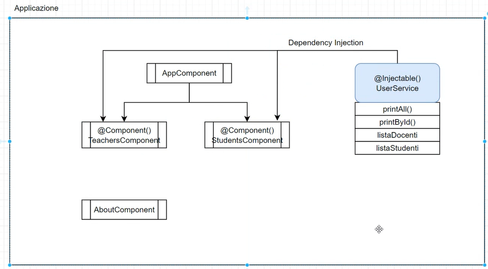

# gitHub prof -> https://github.com/DarioMennilloITS/LezioniAngular24


# LEZ 01
## cosa abbiamo fatto
installato angular aggiornato node.js installato js, breve introduzione al framework, inzializzazione di un progetto di prova e visione generica di come sono composti i file di un progetto.
visionato il file `app.component` in `app/`, modificato il titolo h1 e testato su un webserver locale.
<br>
`Set-ExecutionPolicy + Unrestricted + T` -> comandi da eseguire dentro la powershell da amministratore, da questo momento in poi abbiamo tutti i permessi per lanciare node, npm... e installare script installazioni e via discorrendo


## da fixare a casa


<br><br><br><br>


# LEZ 02
## cosa abbiamo fatto
richieste API, ENDPOINT tramite json, per risolvere problemi di sicurezza, è creato un sistema per blindare i dati quando andiamo a richiamare una API (informarsi meglio).
TS è il linguaggio genitore di js anche se è nato 20 anni dopo, loro si scambiano le informazioni, ma a partitre da eicma 17, js ha introdotto le classi, e si iniziano a scambiare troppe informazioni tra di loro. 
il vantaggio di usare TS è che se abbiamo inizializzato che il tipo sarà ex number, e proviamo a riassegnare la variabile con una stringa, null, bool... ci darà errore, TS è un linguaggio tipizzato (esempi di utilizzo di TypeScript).
esempi di classi anche utilizzando classi su TS che è un aspetto fondamentale in ANGULAR, useremo molto l'implementazione delle classi nei vari file TS, attenzione ai parametri passati ad un metodo (esempio di sommare km con OBBLIGATORIAMENTE CON UN NUMERO)
Il comando `tsc .\intro.ts` serve a compilare un file TypeScript chiamato intro.ts nella stessa directory in cui stai eseguendo il comando:
- Compila il file intro.ts in un file JavaScript (intro.js).

<br>

* src/main.ts -> è il punto principale dell'accensione della nostra app
* app/app.component.ts -> contiene un @Component: è un decoretor ed è una caratteristica di TS, mi dice cosa è quella classe il component definisce tramite un oggetto js come è fatta la classe sottostante e di che "tipo" è

`ng serve --open` -> è usato in Angular per avviare un server di sviluppo locale e aprire automaticamente l'applicazione nel browser predefinito: `SRC/`
01. Compila il Progetto Angular
02. Crea un Server di Sviluppo
03. Esegue il Bootstrap dell'Applicazione
04. Serve i File Statici
05. Apre l'Applicazione nel Browser: L'opzione --open (alias di -o) indica al CLI di aprire 

automaticamente l'applicazione nel browser predefinito, puntando all'indirizzo:
## da fixare a casa
capire meglio la classe dentro component nel progetto angular e come funzionano i files e di come vengono gestiti


<br><br><br><br>


# LEZ 03
## cosa abbiamo fatto

### **`ng new "nome-progetto"`** <br>
Questo comando genera automaticamente la struttura ben organizzata del progetto Angular, creando tutti i file necessari per iniziare.

<br>

### **`l'angular.json`** <br>
 indica varie informazioni del progetto, il versioning, dove fare i test, dove sono collegati vari file di style e di script, quali file sono a livello globale.

Contiene le configurazioni principali del progetto Angular, tra cui:
- Versione del framework.
- Configurazioni di build e test.
- Collegamenti ai file di stile e script globali.
- Informazioni sui percorsi e altre impostazioni del progetto.

<br>

### **`component`** <br> 
Un componente è una classe TypeScript decorata con un decoratore `@Component`.

Un componente collega tre file:
- `HTML` (interfaccia utente).
- `CSS` (stili).
- `TypeScript` (logica del componente).

Ogni componente è come una scatola chiusa e vive in modo indipendente.

Deve essere esportato (**export** + **import**`) per essere utilizzato in altre parti dell'applicazione, come in app.component.ts o in un altro componente.

<br>

## Componenti Angular:
Ogni **componente** è costituito da:
  - **Logica** (`.ts`) -> La classe che gestisce i dati e il comportamento.
  - **Template** (`.html`) -> Il codice HTML che definisce l'interfaccia utente.
  - **Stile** (`.css`) -> Gli stili specifici per quel componente.

<br>

## Il Selector del Componente
Ogni componente ha un selector, `definito nel decoratore @Component`.
Esempio: 
```html
<app-root></app-root>
```

Questo selector permette di **renderizzare il contenuto del file HTML associato al componente**.

Nel caso di `<app-root>`, il contenuto del file **app.component.html** viene caricato all'interno di `<app-root></app-root>`.

- Nota importante: Nel file index.html, il tag <app-root></app-root> rappresenta il punto in cui vive l'intera applicazione Angular.

<br>

## Pezzi del progetto visti oggi
### File principali in src/

### **`index.html`**: 
- Punto di ingresso dell'applicazione Angular.
- Contiene il tag `<app-root>` che viene sostituito dall'app Angular.

### **`main.ts`**:
- Bootstrap dell'app Angular.
- Inizia il rendering del componente principale (`AppComponent`).

### **`styles.css`**:
- Stili globali per l'intero progetto.

<br>

### File principali in app/
### **`app.component.ts`**:
- Componente principale dell'applicazione.
- Contiene il titolo, dati e metodi iniziali.

### **`app.component.html`**:
- Template HTML del componente principale.

### **`app.component.css`**:
- Stili associati al componente principale.

### **`app.config.ts`**:
- Configurazione globale dell'applicazione.

### **`app.routes.ts`**:
- Definizione delle rotte dell'app per la navigazione tra componenti.

<br>

### Componenti aggiuntivi del progetto:
tutti i seguenti componenti elencati assemblati insieme come "blocchi di codice" (HTML+CSS+TS), sono esportabili **verso altri componenti/app/index** dopo averli CONFIGURATI correttamente.

### **`docenti-component`** <br>
Gestisce l'interfaccia e la logica per i docenti, Contiene:
- *`docenti.component.ts`*: Logica del componente.
- *`docenti.component.html`*: Template HTML.
- *`docenti.component.css`*: Stili.

<br>

### **`respo-component`**<br>
Gestisce l'interfaccia e la logica per i responsabili, Contiene:
- *`respo.component.ts`*: Logica del componente.
- *`respo.component.css`*: Stili.
- *`respo.component.html`*: Template HTML.

<br>

### **`studenti-component`**<br>
Gestisce l'interfaccia e la logica per gli studenti, Contiene:
- *`studenti.component.ts`*: Logica del componente.
- *`studenti.component.html`*: Template HTML.
- *`studenti.component.css`*: Stili.


<br><br><br><br>


# LEZ 4
## cosa abbiamo fatto
two-way data binding -> contemporaneamente modifico da entrambi le parti (html / component.ts)

#### lavoriamo nella cartella my-app1-intro!

`ng g c utenti` -> creazione completa del component con tutti i file necessari dentro una cartella utenti/

quando lascio generare il component dalla CLI automaticamente, 
non viene inserito il costruttore questo perchè quando renderizzo (utilizzo il selctor da qualche parte)
viene invocato un costruttore di default.
è necessario crearlo nel momento in cui vogliamo dare delle proprietà e metodi da quel component

dentro public salviamo le immagini con una cartella appostita

il `get` ci permette di prendere qualcosa, ci servirà poi anche ad OSSERVARE quello che succede nella UI.


<br><br><br><br>


# LEZ 5


## esercizio dello strobo
completato l'esercizio dello strobo che cambia colore, spiegazione dei passaggi:

- creazione di un component apposito per esso (html, component, css)
- lo andiamo a importare dentro il app.component.ts negli import[] per poi usarlo nell'html apposito
- inseriamo nell html del `component strobo` un div con un evento in linea dentro l'html, che quando si passa sopra con il mouse, scatta il metodo del component: onChangeBgColor();
- il metodo onChangeBgColor() -> va a generare una stringa con il valore rgb creato random, `eg: "rgb143"`, e andrà assegnata alla proprietà del component `bgColor` che è in attesa di ricevere un valore (!): 
- la proprietà andrà inserita nell'html modificando lo style inline dell' `div strobo`, risultato in codice:
```html
<div class="pallaStrobo" (mousemove)="onChangeBgColor()" [style.background-color]="bgColor"></div>
```
- la classe del component è strutturata così:
```js
export class EsercizioStroboComponent {

  // prima poi questa proprietà avra un colore random generato ogni evento scattato!
  bgColor!: string;

  // metodo che scatta quando si passa sopra alla ball con il mouse
  onChangeBgColor() {
    this.bgColor = `rgb(${this.randomChoiceColor(255)} ${this.randomChoiceColor(255)} ${this.randomChoiceColor(255)})`;
  }

  private randomChoiceColor(color: number) {
    return Math.floor(Math.random() * color);
  }

}
```


---


## comunicazione tra 2 component: decoratori @Input @Output
In Angular, i decorator @Input e @Output servono a facilitare la comunicazione tra componenti, consentendo a un componente genitore di interagire con un componente figlio. Vediamoli in dettaglio:


## 1. @Input
Il decoratore @Input `permette a un componente figlio di ricevere dati da un componente genitore`.

**Funzionamento:**
- Un componente figlio espone una proprietà pubblica decorata con `@Input`.
- Il componente genitore può leggere o scrivere su questa proprietà passando un valore attraverso il binding delle proprietà HTML.

```js
// GENITORE (mittente)
export class ParentComponent {
  parentMessage: string = 'Ciao dal genitore!';
}

// EFFETTUIAMO IL DATA-BINDING DELLE INFORMAZIONI TRAMITE HTML

// FIGLIO (destinatario)
export class ChildComponent {
  @Input() message: string = ''; // Valore ricevuto dal genitore
}
```
<br>

## 2. @Output
Il decoratore @Output `consente a un componente figlio di inviare eventi o notifiche al componente genitore`.

**Funzionamento:**
- Un componente figlio espone una proprietà EventEmitter decorata con @Output.
- Il componente genitore può ascoltare gli eventi emessi dal figlio usando il binding degli eventi HTML.

```js

// FIGLIO (mittente)
export class ChildComponent {
  @Output() notify = new EventEmitter<string>(); // Emittente dell'evento

  notifyParent() {
    this.notify.emit('Ciao dal figlio!'); // Emette l'evento con un messaggio
  }
}


// GENITORE (destinatario)
export class ParentComponent {

  onNotify(message: string) {
    console.log('Messaggio dal figlio:', message);
  }
}
```
<br><br>


## **esercizio di comunicazione tra + components**
Questo esercizio dimostra come due componenti Angular – StudentiComponent (padre) e StudenteComponent (figlio) – possano comunicare tramite decoratori @Input e @Output.

### StudentiComponent:
- Rappresenta il `componente padre`.
- Contiene un elenco di studenti (id, nome, cognome).
- Passa i `dati al figlio StudenteComponent tramite @Input`.

### StudenteComponent:
- Rappresenta il `componente figlio`.
- Riceve le proprietà del padre tramite @Input.
- Genera una proprietà aggiuntiva `"matricola" e può emettere eventi verso il padre tramite @Output`.


<br><br><br><br>


# LEZ 6
esercitazione pizzeria (molto simile a quello di studenti / studente)
capire come effettivamente funziona la comunicazione da entrambi i versi;
@Input da PADRE a figlio
@Output da FIGLIO a padre

**approcio del prof**
- iniziare dal lato front quindi dagli HTML, partendo da `<app-pizzeria>`, mettendo i contenuti e stilizzando il tutto

- lavorare sul lato HTML del `<lista-pizze>` mettendo tante pizze di esempio (DIVIDERE IL LAVORO A PACCHETTI!)
- dopodiche andiamo a lavorare sull'app component a cui `importiamo il component di pizzeria`
- dopodiche andiamo a lavorare sul component di pizzeria a cui andiamo ad importare principalmente il component `lista-pizze`, il file che contiene gli oggetti con le pizze `INFORMAZIONI_PIZZE`, e anche l'interfaccia `pizza-model` che dice cosa deve contenere gli oggetti PIZZA contenuti nella `INFORMAZIONI_PIZZE`.
- attenzione che dato che `lista-pizze` è il figlio LUI DEVE RACCOGLIERE / EREDITARE (@Input) le informazioni sulle pizze dal suo genitore `pizzeria`
- ha mostrato le pizze nella `lista-pizze` tramite index number dell'array che contine gli oggetti pizza, al posto di usare un ciclo for
```ts
<li>
  {{listaPizze[0].nome}}
</li>
```
- seguire il flusso e i commenti per capire il resto del codice (uguale alla mia soluzione)


<br><br><br><br>


# LEZ 7 - 8
perchè usare i signal() al posto di come abbiamo sempre fatto?
Angular tutte le volte che si cambiava una prop aveva l'auto change detection e cambiava il tutto, 
con i signal() non viene sfruttato angular a pieno sotto questo aspetto e diciamo che c'è ne dobbiamo occupare noi `.set()`

ESERCIZIO
il padre `lez-5` ha la lista dei responsabili (DB), e cicla app-user


<br><br><br><br>


# LEZ 9 / 10
two-way-data-binding, è un sistema vecchio che reggeva l'angualar vecchio anche se oggi viene utilizzato ancora molto!
iniziamo a lavorare con i form senza andare ad utilizzare queryselector.value per prendere il testo dell'input nel form.

ci da una direttiva che si chiama `ngModel` che è uno strumento che ci permtte di rendere il nsotro codice + performante

UTILIZZO dei pipe !| ...

two-way-data-binding tramite i signals facendo delle prove con dei form aggiungendo dati in cui si aggiornano sia l'HTML che il TS, possibilità anche di aggiungere dei dati gia prescritti tramite un bototne, usare i pipe | per implementare la view


`ng new my-app4-no-standlone --no-standalone` per non includere nell'installazione di un progetto applicazione no stand alone (non serve + oggi!), il progetto sarà creato in maniera diversa da come è sempre stata fatta per via del aver escluso lo standalone!!

- il `app.module.ts` -> Punto centrale per registrare componenti, servizi e moduli:
 - Il file principale per registrare tutti i componenti, moduli, servizi e direttive.
- Ogni nuovo componente deve essere declarato nel modulo (nella sezione declarations).

```ts
//* Punto centrale per registrare componenti, servizi e moduli. qui è TUTTO CENTRALIZZATO, non è + STANDALONE
//* 01. declarations -> sezione è utilizzata per dichiarare i componenti, le direttive e i pipe che appartengono a un modulo specifico. 
//* Qualsiasi elemento dichiarato in declarations è conosciuto solo all'interno di quel modulo, a meno che non venga esportato.

//* 02. imports -> viene utilizzata per importare altri moduli necessari per il funzionamento del modulo corrente. 7
//* I moduli importati possono essere: Moduli di Angular, come BrowserModule, FormsModule,
```


## Progetto di introduzione completa
**ToDo list**
cercare di fare come nella struttura disegnata dal prof, usando tutte le competenze apprese fino ad oggi!
leggere i commenti e il codice di `project/`


<br><br><br><br>


# LEZ 10
SE IO ho tanti component e l'app diventa grossa, come faccio a non impazzire se ci sono troppi gradi di parentela (un component dentro l'altro dentro l'altro...), la soluzione sono l'utilizzo dei:
 **`services basati sulla dependency injection`**

## Cos'è un Service?

Un **service** è una classe o modulo che fornisce funzionalità condivise e riutilizzabili all'interno di un'applicazione. 
In genere, i servizi:
- Contengono logica di business
- Gestiscono i dati (recupero, elaborazione, salvataggio)
- Permettono di condividere informazioni tra componenti senza un forte accoppiamento

Esempio di un service in TypeScript (Angular):

```typescript
import { Injectable } from '@angular/core';

@Injectable({ providedIn: 'root' })
export class DataService {
  private data: any[] = [];

  getData() {
    return this.data;
  }

  setData(newData: any) {
    this.data.push(newData);
  }
}
```


### Perché Usare i Services?

- **Separazione delle responsabilità**: La logica non è all'interno di componenti, ma è delegata a un service.
- **Riutilizzabilità**: Un service può essere utilizzato da più componenti.
- **Manutenibilità**: Codice più organizzato e modulare.


## Dependency Injection (DI)

La **Dependency Injection** è un design pattern che permette di fornire le dipendenze (ad esempio, i servizi) ai componenti o classi che ne hanno bisogno, piuttosto che crearle direttamente.


### Come Funziona la DI?

La DI utilizza un **container** che:
1. Crea e gestisce le istanze dei servizi.
2. Fornisce automaticamente un'istanza del servizio a chi ne ha bisogno.

Esempio in Angular:
- Il decoratore `@Injectable` indica che la classe è un service e può essere iniettato.
- I componenti dichiarano le dipendenze nel loro costruttore.

```typescript
import { Component } from '@angular/core';
import { DataService } from './data.service';

@Component({
  selector: 'app-my-component',
  template: '<div>{{ data }}</div>'
})
export class MyComponent {
  data: any[];

  constructor(private dataService: DataService) {
    this.data = this.dataService.getData();
  }
}
```


### Scope di un Service

- **root**: Il service è disponibile in tutta l'applicazione.
- **module**: Il service è disponibile solo nel modulo in cui è dichiarato.
- **component**: Il service è specifico per una gerarchia di componenti.


## Vantaggi dell'Uso dei Services e DI

1. **Riduzione della Complessità**
   - Gestire molti componenti è più semplice quando la logica comune è isolata in un service.

2. **Testabilità**
   - I servizi possono essere facilmente sostituiti con mock durante i test.

3. **Scalabilità**
   - Con l'uso dei services, è più semplice aggiungere funzionalità senza modificare profondamente il codice esistente.


## Best Practices

1. **Singola Responsabilità**
   - Ogni service dovrebbe avere un compito ben definito.

2. **Iniezione nel Costruttore**
   - Dichiarare i servizi come dipendenze del costruttore, evitando di crearli direttamente.

3. **Uso di Interfacce**
   - Se possibile, usare interfacce per definire le dipendenze, rendendo il codice più flessibile e testabile.

4. **Lazy Loading**
   - Caricare i servizi solo quando necessario per ottimizzare le performance dell'app.


## Modi per inniettare i services!

**1 modo**
```tsx
constructor(private parentiService: ParentiService);
```

**2 modo**
```tsx
private parentiService = inject(ParentiService);
```


---


## Conclusione
L'uso dei **services** e della **dependency injection** permette di organizzare il codice in modo pulito, modulare e manutenibile. Questo approccio è essenziale per applicazioni di grandi dimensioni o con una gerarchia complessa di componenti, riducendo il rischio di accoppiamento e migliorando la riutilizzabilità del codice.


  
- `ng g s` -> comando per generare un services all'interno di un componente specifico


<br><br><br><br>


# LEZ 11 - 12
- revisione del progetto della todo list, e proegettino di listaggio di ricette con ingredienti e dinamicamente modificabile

## Form handling


<br><br><br><br>


# Progetto esercizio vacanze
- https://fad.its-ictpiemonte.it/course/view.php?id=1370#section-16

immagina di essere già loggato come un utente che ha accesso a una lista di videogiochi da comprare per aggiungere alla 
- **Componenti**
  - videogames
    - videogame
    - prenotazione-videogame

- **Form di prenotazione videogame**
  - nome, congome, email, telefono, indirizzo di spedizione
  - validazione di questi dati
  - bottone di conferma per la prenotazione
  - reindirizzamento e aggiornamento dello stato del videogame prenotato!

- **Models**
  - Videogame.model.ts:
  titolo(string), descrizione(string), genere(string), dataDiRilascio(string), immagineCopertina(string), statoDisponibilita(boolean)


<br><br><br><br>


# LEZ 13  
gestione dei form tramite ngForm dentro `my-app5-lezioni/lez9`, prove commenti di come funziona e il loro utilizzo.
implementazione di un altro component dentro `my-app5-lezioni/lez10`, che contiene una versione avanzata dei form, tramite **Reactive forms**:
## Reactive Forms
Questo approccio è potente, modulare e consente di aggiungere facilmente logiche complesse per la validazione.
- Validazione asincrona: Usa gli observable di RxJS per simulare la comunicazione con un server.
- Custom Validator: Permette di implementare regole specifiche, migliorando la flessibilità del form.
- Best Practice: I getter separano la logica di validazione dal template, mantenendo il codice leggibile e testabile.


<br><br><br><br>


# LEZ 14
installazione di una libereria che permette di avere un mini server backend in locale tramite un file json che contiene le possibili oprazioni CRUD, in maniera globale -g, da utilizzare dentro una cartella backend, comandi:

```bash
- npm i -g json-server
```

```bash
- json-server --watch db.json
```

entrare nella cartella apposita con il file con json delle documentazione e runnarlo
si potra vedere nel terminale che abbiamo un index contente le varie rotte, possiamo aggiungere anche dei dati e verrano mostrati e aggiornati in pagina index!:
```json 
 "students": {
        "nome": "Gabriele",
        "cognome": "Speciale",
        "classe": "5A SIA",
        "corso": "web-dev"
    }
```
volendo si può anche testare l'API GET tramite thunder client, esempio in questo caso: `http://localhost:3000/students`


- cartella public: serve per poter inserire file statici tipo immagini, quando devo servire anche i file statici lancio il comando: 
  - json-server --watch db.json -s ./public cosi do anche la possibilità di runnare anche la public

implementazione ed esempio con commenti dentro `myapp7-http`

## codice creato diviso in 2 parti
### mattina
la parte delle chiamate HTTP fatte nei vari component in maniera disordinata è tutta commentata anche se prima funzionava
### dopo intervallo
abbiamo creao un .service.ts dentro utenti (padre di tutti), per gestire le varie chiamate HTTP delle API passando il loro path in maniera dinamica


<br><br><br><br>


# LEZ 15
ripasso dell'http servecies e introduzione al routing su angultar